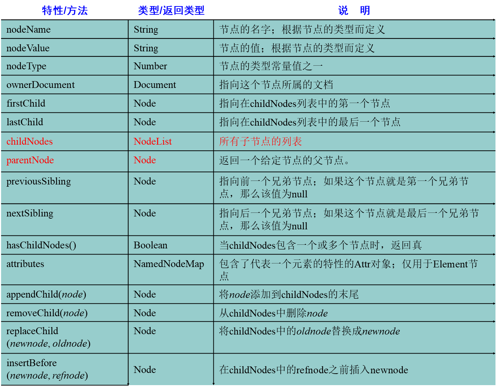

# JavaScript
## 目录
### JavaScript语言的组成
- ECMAScript	标准（js的语法，变量，函数）
- BOM			（Browser Object Model）	浏览器对象模型
- DOM			（Document Object Model）	文档对象模型
### JavaScript的语法
- 把js和HTML的结合一起。（2两种方式）
    - js和HTML的结合
         - HTML的文件提供了一个标签	<script type="text/javascript">js的代码</script>，标签可以放在HTML文件的任意位置上。
    - 引入外部的文件，有一个外部的文件。编写js文件。
        - <script src="引入js文件（相对路径）" >
        - 如果script通过src的属性引入了外部的文件，里面的js代码就不会执行了。
- 关键字
    - var	声明变量
- 标识符
    - 和Java一样
- 注释
    - 和Java一样
- 变量
    - 声明变量，只使用一个关键字	var num = 12;  var str = "abc";
- 5种基本数据类型
    - String     字符串类型
        - js中双引号和单引号都代表的是字符串
    - Number
        - 不区分整数和小数
    - Boolean     布尔类型
    - Null      空，给引用赋值的
    - Undefined    未定义(声明变量，没有赋值)
- js的运算符
    - 算数运算符
        - 0或者null是false，非0或者非null是true
    - 赋值运算符
        - 和Java一样
    - 比较运算符
        - ==	比较值是否相同
        - ===	比较值和类型是否相同
    - 逻辑运算符
        - 和Java一样
    - 三元运算符
        - 条件?值1:值2
- js的数组
    - Java中`String [] str = {};`
    - js中声明数组
        - var arr = [12,34,55];
        - var arr = new Array(5);		声明数组，长度是5
        - var arr = new Array(2,3,4);	声明数组，元素是2 3 4
    - 数组的属性
        - 长度：length
        - 数组的长度是可变的。
### js的方法
- Java中
```java
public String 方法名称(参数列表(int num,String str)){
			方法体;
			return null;
}
```
- js中，通过关键字function声明方法
```JavaScript 
function 方法名称(参数列表 (num,str)){
			方法体;
     		return;
}
```
- 参数列表：不能使用var关键字
- 返回值：可写可不写的，如果有写返回值，如果没有，返回值可以省略不写。
- 调用函数
```JavaScript
function 函数名称(参数列表不能使用var关键字){
		函数体;
		return;	返回值没有可以不写
}
					
function getSum(){
		return 100;
}
					
var sum = getSum;    //将getSum的引用给了sum，此时也可用sum来调用函数
		sum();
```
### js的动态函数和匿名函数
- 动态函数，js提供了内置对象Function
```JavaScript
var param1 = "x,y";
var param2 = "var sum;sum=x+y;return sum;";
var param3 = "var sum;sum=x*y;return sum;";
		
var add = new Function(param1,param3);
var sum = add(4,5);     //传入参数4,5   x=4，y=5
alert(sum);     //输出20
```
- 匿名函数，没有名称的函数
```JavaScript
var getSum = function (){
	 	return 100;
};
alert(getSum());
```
### js的全局变量和局部变量
- 全局变量：在<script>标签内部定义的变量，全局变量。
- 局部变量：在函数的内部定义的变量，局部变量。
```JavaScript
<script type="text/javascript">
		var j = 5;	// 全局变量
		
		for(var i=0;i<3;i++){
			document.write(i+"<br />");
		}
		
		document.write("i == "+ i+"<br/>");
		
		function add(y){
			y = 5; // 局部变量
		}
		// document.write(y);
		
		
		var x = 4;	// 全局变量
		function show(x){ //这个x是局部变量，传入4
			x = 8;       //使用的是局部变量的x，全局变量的值没有变
		}
		show(x);
		alert("x = "+x);		// 输出x=4
</script>
```
### JavaScript的对象和API
#### String对象
- 声明
    - var str = "abc";
    - var str = new String("abc");
        - 属性：length：字符串的长度	
        - 方法：
        - 和HTML相关的方法（书写没有提示的）
        - bold()			使用粗体显示显示字符串
        - fontcolor(color)		参数是必须的，设置字体的颜色
        - fontsize(size)		设置字体的大小（1-7）
        - italics()				斜体
        - link(url)				设置链接
        - sub()					下标
        - sup()					上标
    - 和java中String对象类似的
        - charAt(index)				返回指定位置的字符
        - indexOf(str,fromIndex)	检索字符串，没有返回-1
        - lastIndexOf(str,fromIndex)	从后向前检索字符串
        - replace(要替换的字符串,替换成啥)		
        - substring(start,stop)				截取字符串
        - substr(start,length)				截取字符串，从哪开始，截取多长
			
    - 定义一个方法：可以去掉字符串两边的空格。[代码](https://github.com/wangwren/javascript/blob/master/js%E5%AD%97%E7%AC%A6%E4%B8%B2%E5%AF%B9%E8%B1%A1.html)	
- String 对象
    - 声明
        - var str = "abc";
        - var str = new String("abc");
    - 属性：length：字符串的长度	
    - 方法：
        - 和HTML相关的方法（书写没有提示的）
        - bold()			使用粗体显示显示字符串
        - fontcolor(color)		参数是必须的，设置字体的颜色
        - fontsize(size)		设置字体的大小（1-7）
        - italics()				斜体
        - link(url)				设置链接
        - sub()					下标
        - sup()					上标
    - 和java中String对象类似的
        - charAt(index)				返回指定位置的字符
        - indexOf(str,fromIndex)	检索字符串，没有返回-1
        - lastIndexOf(str,fromIndex)	从后向前检索字符串
        - replace(要替换的字符串,替换成啥)		
        - substring(start,stop)				截取字符串
        - substr(start,length)				截取字符串，从哪开始，截取多长
- Array对象
    - 声明数组
        - var arr = [12,33]
        - var arr = new Array(4,4);
    - 属性:length:长度
    - 方法:
        - concat(元素或数组)，拼接数组，返回新的数组
        - join(s)  通过s标识，相当java中的split，用指定符号分隔。返回字符串
        - pop()    删除末尾的元素，返回最后一个元素
        - push()   向末尾添加元素，返回新数组的长度
        - sort()     排序的方法
- Date日期对象
    - var date = new Date();    当前的日期
    - toLocaleString()     转换本地的日期格式
    - toLocalDateString()    只包含日期
    - toLocalTimeString()    只包含时间
    - getDate()    返回一个月中的某一天(1-31)
    - getDay()     返回一周中的某一天(0-6)   0代表礼拜天
    - getMonth()   返回月份(0-11)  0代表一月
    - getFullYear()     返回年份
    - getTime()     返回毫秒数
    - setTime()     通过毫秒数获取日期
    - parse(str)    解析字符串，返回毫秒数
        - Date.parse(str);
        - str: 2014-11-14  解析不了
            - 11/14/2014可以解析
            - 2014,11,14  可以解析
- Math和数字相关的对象
    - Math对象的静态方法
    - ceil(x)   上舍入
    - floor(x)   下舍入
    - round(x)   四舍五入
    - random()   0-1的随机数
- RegExp对象
    - 正则表达式对象
    - 应用:编写注册的表单，对表单输入的内容进行校验
        - var reg = new RegExp("表达式");   开发中不经常使用
        - var reg = /表达式/   开发中经常使用
        - var reg = /^表达式$/   开发中经常使用
            - reg.exec(string)   不经常使用，如果匹配，返回匹配结果
            - reg.test(string)   经常使用，如果匹配，返回是true，如果不匹配，返回是false
- 全局函数
    - 使用全局函数，不需要任何的对象。
    - 全局函数可以直接拿过来使用。
    - global帮着管理全局函数。
    - eval()		可以解析字符串，执行字符串中间的js代码
    - isNaN()		判断是否是非数字值
    - parseInt()	解析字符串，返回整数
    - encodeURI()	进行编码
    - decodeURI()	解析解码
### BOM浏览器对象模型
- (Brower Object Model)
- Window  窗口对象
    - alert()		弹出提示框
    - confirm("参数")		询问框
        - 提供俩按钮，确定和取消
        - 如果点击是确定，返回true，如果点击取消，返回false
    - moveBy()			移动浏览器
    - setInterval("函数",毫秒值)		定时相关的
        - 每隔毫秒值执行一次函数
        - 返回唯一的id值
    - setTimeout("函数",毫秒值)
        - 到了毫秒值后执行一次函数
        - 返回唯一的id值
    - 清除定时
        - clearInterval(id的值)
        - clearTimeout()
    - close()	关闭浏览器的窗口
    - open("url","name","窗口特征")	打开浏览器窗口
    - 属性
        - opener 返回对创建此窗口的窗口的引用。
        - win  open()	弹出baidu的窗口
            - 在baidu窗口中  baidu.opener	得到了win的引用。
- Navigator   和浏览器版本相关的对象
    - userAgent    获取浏览器的相关的信息
    - window.navigator.userAgent    window可以省略不写
- Screen    和屏幕相关的对象
- History    和浏览器历史相关
    - back()   返回上一个页面
    - forward()   去下一个页面
    - go()
        - 传参数，go(1)  等于forward；go(-1)  等于back()
- Location   和浏览器地址相关的对象
    - href  获取和设置浏览器的路径
- 事件
    - onclick  点击事件
- Document   文档对象
    - document.getElementById("nameId");
### DOM文档对象模型
- Document Object Model
- 文档:标记型文档(HTML/XML)
- 对象:封装属性和行为(方法)
- 模型:共性特征的体现
- DOM解析HTML
    - 通过DOM的方法，把HTML全部（元素（标签）、文本、属性）都封装成了对象。
    - DOM想要操作标记型文档先解析。（解析器）
    - DOM解析HTML（浏览器就可以解析HTML）
- DOM的三个级别：
    1. 将HTML文档封装成对象。
    2. 在1的基础上添加新的功能，例如:对于事件和CSS样式的支持。
    3. 支持xml1.0的一些新特性。
- DHTML不是一种编程语言。
    - html		：封装数据。	<span>展示给用户的数据</span>
    - css		：设置样式（显示效果
    - dom		：操作HTML（解析HTML）
    - js		：提供逻辑（判断语句，循环语句）
- Document：代表整个文档。
    - getElementById("id的值");			通过元素的id的属性获取元素（标签）对象。
    - getElementsByName("name属性值");		通过名称获取元素对象的集合（返回数组）
    - getElementsByTagName("标签名称");	通过标签名称获取元素对象的集合（返回数组）
    - write("文本的内容（html的标签）")		把文本内容写到浏览器上。
    - createElement("元素名称");		创建元素对象
    - createTextNode("文本内容")		创建文本对象
    - appendChild("子节点")				添加子节点
  
**按照上面的写，没括号就是没括号**    
- Element对象
    - 获取元素对象
        - getAttribute("属性名称");	      获取属性的值
        - setAttribute("属性名称","属性的值");	设置或者修改属性的值
        - removeAttribute("属性名称");		删除属性
    - 获取元素下的所有子节点
        - ul.getElementsByTagName();   需要先获取到子节点的父节点
- Node节点对象
    - nodeName		：节点名称
    - nodeType		：节点类型
    - nodeValue		：节点的值
    - parentNode	获取父节点（返回永远是一个元素节点）


|IE6-8|IE9-11  Chrome  FireFox|
|--------------|--------------|
|firstChild 获取第一个节点|firstElementChild获取第一个节点|
|lastChild最后一个节点|lastElementChild 最后一个节点|
|nextSibling 下一同级节点|nextElementSibling下一同级节点|
|previousSibling 上一同级节点|previousElementSibling?上一同级节点|

```html
<ul>
				<li>北京</li>
			</ul>	
			
			* 如果通过ul获取北京的子节点，使用是	ul.firstElementChild;	获取北京的子节点（IE9-11 Chrome FireFox）
				* 但是如果IE6-8，需要使用firstChild;	
				
			<span id="spanId">
				文本内容
			</span>	
			
			* 使用span的标签获取span中间的文本内容（也是对象）,需要使用firstChild;（不管是什么浏览器）
```
- 方法
    - hasChildNodes()		检查是否包含子节点
     - hasAttributes()		检查是否包含属性
    - appendChild(node)			父节点调用，在末尾添加子节点
    - insertBefore(new,old)		父节点调用，在指定节点之前添加子节点
    - replaceChild(new,old)		父节点调用，替换节点
    - removeChild(node)			父节点调用,删除节点
    - cloneNode(boolean)		不是父节点调用,复制节点
            - boolean：如果是true，复制子节点。如果是false，不复制子节点，默认是false。
- innerHTML	：获取和设置文本内容。
    - innerHTML属性：
        - 获取文本内容:`uname.innerHTML`
        - 设置文本内容:`uname.innerHTML=""`
        - 参见案例:[innerHTML对象](https://github.com/wangwren/javascript/blob/master/innerHTML.html)
- 事件
    - 鼠标移动的事件
        - onmousemove
        - onmouseout
        - onmouseover
    - 鼠标点击事件
        - onclick			单击
        - ondblclick		双击
    - 加载和卸载
        - onload		加载
        - onunload		卸载
    - 获取焦点和失去焦点
        - onfocus		获取焦点
        - onblur		失去焦点
    - 键盘
        - onkeyup		按下抬起时触发
    - 改变事件
        - onchange
    - 控制表单的提交
        - onsubmit   需要把onsubmit作用在表单上`<form onsubmit="">`
        - 值的写法:  `onsubmit="return run()"`
        - run()必须有返回值，必须返回true或false。返回false表单不能提交，如果没有返回值，默认是表单提交。
        - run()中写表单的校验。
        - 可以通过js提交表单。
```JavaScript
// 通过id获取form
		// var form = document.getElementById("formId");
		// 通过form的name的属性获取表单
		var form = document.form1;
		//var name = document.form1.username.value;
		//alert(name);
		
		// 设置提交的路径
		form.action = "success.html";
		form.method = "get";
		// 提交表单
		form.submit();
```


	
	
	
	
	
	


