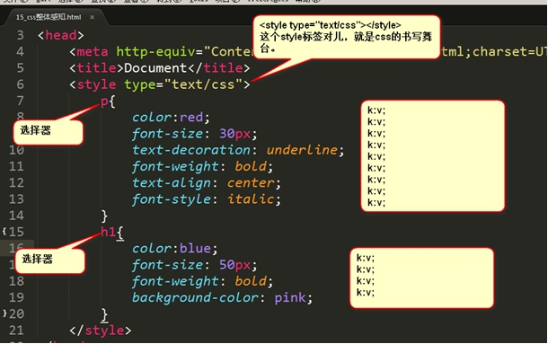

# 前端           
## 目录
- **[快捷键](#快捷键)**     
- **[互联网原理](#互联网原理)** 
- **[HTML](#htmlhypertext-markup-language-超文本标记语言)**                                                                               
    - **[Sublime](#sublime)**
    - **[html完整的骨架](#html完整的骨架)**
    - **[文档声明头](#文档声明头)**
    - **[字符集](#字符集)**
    - **[关键字和页面描述](#关键字和页面描述)**
    - **[title标签](#title标签)**
    - **[HTML的基本语法特性](#html的基本语法特性)**
    - **[h和p标签](#h和p标签)**
        - **[h标签](#h标签)**
        - **[p标签](#p标签)**
    - **[图片](#图片)**
        - **[路径说明(相对路径)](#路径说明相对路径)**
    - **[超链接](#超链接)**
    - **[页面内的锚点](#页面内的锚点)**
    - **[列表](#列表)**
        - **[无序列表](#无序列表)**
        - **[有序列表](#有序列表)**
        - **[定义列表](#定义列表)**
    - **[div和span标签](#div和span标签)**
        - **[div标签](#div标签)**
        - **[span标签](#span标签)**
    - **[表单](#表单)**
        - **[文本框](#文本框)**
        - **[密码框](#密码框)**
        - **[单选按钮](#单选按钮)**
        - **[复选框](#复选框)**
        - **[下拉列表](#下拉列表)**
        - **[多行文本框（文本域)](#多行文本框文本域)**
        - **[三种按钮](#三种按钮)**
        - **[label标签](#label标签)**
    - **[html注释](#html注释)**
    - **[字符实体](#字符实体)**
## 快捷键
- 键盘上除了有字母、数字之外，还有一些特殊的按键：ctrl、shift、alt、tab
    - ctrl键是英语control“控制”的意思，这个按键，单独按没有任何作用，都要和其他的按键一起按才有用。比如ctrl+c，表示同时按住ctrl键和c键，一会儿将知道这个功能是复制。
    - shift键是英语shift“换挡”的意思，按下这个按键同时击打字母，打出的就是大写字母。熟悉shift键来打大写字母，尽量少用大小写锁定键。
    - alt键是英语alternate“调整”的意思，和ctrl一样，自己按没啥用，都要和其他的按键一起按才有用。比如alt+f4，表示关闭当前的窗口，比如你正在玩儿游戏，老板来了，可以按alt+f4快速关闭窗口。
    - tab键是用于table“制表符”的意思，经常实现“切换的功能”。比如我们在word软件中同时打开了两个文档，可以用ctrl+tab键，来在两个文档之间切换。 当然，可以用alt+tab键来切换程序。
- ctrl+c 		复制
- ctrl+v 		粘贴
- ctrl+x 		剪切（就是移动文件，在原来的文件夹ctrl+x一个文件，然后在新文件夹中ctrl+v粘贴）
- ctrl+tab 		切换（具体切换什么，要看是什么软件）
- alt+F4 		关闭程序
- F2 			重命名
- F5 			刷新，比如看网页的时候，想刷新网页，按f5
- ctrl+z 		撤销，就是这一步干错了，就ctrl+z撤销
- windows+E 	打开资源管理器
- windows+D	显示桌面
- ctrl+空格		切换中英文，严禁用shift键切换
## 互联网原理
- 服务器上存放着网页的相关文件，包括html文件、css文件、js文件、图片等。当我们打开浏览器，输入网址，我们的计算机就会对这些文件发出HTTP请求。
- 服务器收到请求之后，会把这些文件通过HTTP协议，传输到我们的计算机中（保存到了刚才那个临时文件夹中）。这些文件，将在我们计算机本地的浏览器中，进行渲染、呈递。

## HTML(HyperText Markup Language 超文本标记语言)
**HTML是负责描述文档语义的语言**  
**html就是负责描述页面的语义；css负责描述页面的样式；js负责描述页面的动态效果的。**  
所以，html不能让文字居中，不能更改文字字号、字体、颜色。因为这些都是属于样式范畴，都是css干的事儿；html不能让盒子运动起来，因为这些属性行为范畴，都是js干的事儿。  
**html只能干一件事儿，就是通过标签对儿，给文本增加语义。这是html唯一能做的。**  
html是一个纯文本文件（就是用.txt文件改名而成），用一些标签来描述文字的语义，这些标签在浏览器里面是看不到的，所以称为“超文本”，所以就是“超文本标记语言”了。  
> 比如，面试的时候问你，h1标签有什么作用？  
> 正确答案：给文本增加主标题的语义  
> 错误答案：给文字加粗、加黑、变大  
### Sublime
- sublime中的常用快捷键：
    - ctrl+滚轮		放大缩小文字
    - ctrl+shift+d	复制当前行
    - ctrl+shift+k	删除当前行
    - ctrl+shift+↑	上移当前行
    - ctrl+shift+↓	下移当前行
    - 点击鼠标滚轮进行多行编辑
    - html:xt 之后按tab 自动生成html基本骨架
以后击打标签的时候，仅仅需要输入标签的名字，然后按tab就可以自动生成标签对儿了。
比如，输入p然后按tab，软件自动生成。
### html完整的骨架
```html
<!DOCTYPE html PUBLIC "-//W3C//DTD XHTML 1.0 Transitional//EN" "http://www.w3.org/TR/xhtml1/DTD/xhtml1-transitional.dtd">
<html xmlns="http://www.w3.org/1999/xhtml" xml:lang="en">
	<head>
		<meta http-equiv="Content-Type" content="text/html;charset=UTF-8">
		<title>哈哈哈</title>
	</head>
	<body>
		 <h1>我是一个主标题</h1>
         <p>我是一个小段落</p>
	</body>
</html>
```
- 第1行，就是网页的声明头。术语叫做DocType Defintion，文档类型定义，简称DTD。这行语句非常的复杂，里面暗含了一个网址。W3C就是出web规范的组织机构。html、css、js的规范都是W3C定义发布的。world wide web coalition , 国际万维网联盟。网页声明头可以告诉浏览器，这是一个什么标准的页面。
- 第2行，是最大的html标签，所有的网页内容，都要包裹在这个标签对儿里面。
    - 我们发现，html标签中，有两个属性：
        - xmlns="http://www.w3.org/1999/xhtml"   命名空间，就是一个规范；
        - xml:lang="en" 语言是英语
- 第3行，就是head标签，就是配置。
- 第4行，<meta http-equiv="Content-Type" content="text/html;charset=UTF-8"> 字符集的配置
- 第5行，<title>哈哈哈</title>  网页的标题，可以显示在浏览器的标签栏中。
- 第7行，body标签就是网页的内容，用户能够看见。
### 文档声明头
- HTML4.01里面有两大种规范，每大种规范里面又各有3种小规范。所以一共6种规范。
- HTML4.01里面规定了普通、XHTML两大种规范。
- sublime输入的html:xt  x表示XHTML，t表示transitional
- **HTML5中极大的简化了DTD，也就是说HTML5中就没有XHTML了**
```html
<!DOCTYPE html>
<!--H5-->
<html lang="en">
<head>
	<meta charset="UTF-8">
	<title>Document</title>
</head>
<body>
	
</body>
</html>
```
- 规范说明:

|大规范|小规范|
|-----------|---------|
|HTML4.01|Strict 严格的，体现在一些标签不能使用，比如u|
||Transitional   普通的|
| |Frameset     带有框架的页面|
|XHTML1.0 更为严格(严格体现在小写标签、闭合、引号)|Strict        严格的，体现在一些标签不能使用，比如u|
| |Transitional   普通的|
| |Frameset     带有框架的页面|
### 字符集
```html
<meta http-equiv="Content-Type" content="text/html;charset=UTF-8">
```
字符集用meta标签定义，meta表示“元”。“元”配置，就是表示基本的配置项目。  
中文能够使用的字符集两种：
- 第一种：UTF-8
```html
<meta http-equiv="Content-Type" content="text/html;charset=UTF-8">
```
- 第二种:gb2312
```html
<meta http-equiv="Content-Type" content="text/html;charset=gb2312">
<!--或者-->
<meta http-equiv="Content-Type" content="text/html;charset=gbk">
```
**UTF-8里面存储一个汉字3个字节。而gb2312中存储一个汉字2个字节。**
### 关键字和页面描述
- meta除了可以设置字符集，还可以设置关键字和页面描述。
- 设置页面描述：
```html
<meta name="Description" content="网易是中国领先的互联网技术公司，为用户提供免费邮箱、游戏、搜索引擎服务，开设新闻、娱乐、体育等30多个内容频道，及博客、视频、论坛等互动交流，网聚人的力量。" />
```
**只要设置Description页面描述，那么百度搜索结果，就能够显示这些语句，这个技术叫做SEO，search engine optimization，搜索引擎优化。**
```html
<meta name=”” content=”” />
```
- 定义关键词：
```html
<meta name="Keywords" content="网易,邮箱,游戏,新闻,体育,娱乐,女性,亚运,论坛,短信" />
```
这些关键词，就是告诉搜索引擎，这个网页是干嘛的，能够提高搜索命中率。让别人能够找到你，搜索到你。  
所以，一个比较完整的骨架是这样：  
```html
<!DOCTYPE html PUBLIC "-//W3C//DTD XHTML 1.0 Transitional//EN" "http://www.w3.org/TR/xhtml1/DTD/xhtml1-transitional.dtd">
<html xmlns="http://www.w3.org/1999/xhtml" xml:lang="en">
<head>
	<meta http-equiv="Content-Type" content="text/html;charset=UTF-8">
	<meta name="Keywords" content="牛逼，就牛逼" />
	<meta name="Description" content="网易是中国领先的互联网技术公司，为用户提供免费邮箱、游戏、搜索引擎服务，开设新闻、娱乐、体育等30多个内容频道，及博客、视频、论坛等互动交流，网聚人的力量。" />
	<title>Document</title>
</head>
<body>

</body>
</html>
```
### title标签
```html
<title>网页的标题</title>
```
- title也是有助于SEO搜索引擎优化的
>网页的head标签里面，表示的是页面的配置，有什么配置？  
>字符集、关键词、页面描述、页面标题。  
>还可以配置：IE适配、视口、iPhone小图标等等  

### HTML的基本语法特性
- HTML对换行不敏感，对tab不敏感
    - HTML只在乎标签的嵌套结构，嵌套的关系。谁嵌套了谁，谁被谁嵌套了，和换行、tab无关。
换不换行、tab不tab，都不影响页面的结构。
- 空白折叠现象
    - HTML中所有的文字之间，如果有空格、换行、tab都将被折叠为**一个空格**显示。
- 标签要严格封闭
### h和p标签
#### h标签
- h是**容器级**的标签。理论上里面可以放置p、ul，但是在语义上不这么做
#### p标签
- 段落
- HTML标签是分等级的，HTML将所有的标签分为两种：容器级、文本级。
    - **容器级的标签，里面可以放置任何东西**
    - **文本级的标签里面，只能放置文字、图片、表单元素。(包括文本级标签)**
- p标签是一个文本级标签。
### 图片
- HTML页面不是直接插入图片，而是插入图片的引用地址，所以也要把图片上传到服务器上。
```html

```
- 属性说明
    - src 表示图片的路径
    - alt 是英语alternate“替代”的意思，就表示不管因为什么原因，当这个**图片无法被显示**的时候，出现的**替代文字**（有的浏览器不支持）。
#### 路径说明
- 相对路径
- 相对路径的好处：站点不管拷贝到哪里，文件和图片的相对路径关系都是不变的。  
- 相对路径使用有一个前提，就是网页文件和你的图片，**必须在一个服务器上。**
如果是上一级目录中的图片
```html

```
如果是上两级目录中的图片
```html

```
- 绝对路径
所有以http://开头的路径，就是绝对路径。(因为项目是要放到服务器上的，写盘符的绝对路径没有意义)  
```html

<a href="http://www.sohu.com">点击我跳转到搜狐</a>
```
### 超链接
基本语法
```html
<a href="1.html">哈哈哈</a>
<!--href 表示要跳转的界面-->
```
- 超链接的另外两个属性说明
```html
<a href="1.html" title="啦啦啦" target="_blank">哈哈哈</a>
```
- title
    - 当鼠标停在链接地址不动时显示的悬停文字
- target
    - 在新的标签页(新窗口)中打开，如果不写就是在当前标签页中打开
#### a标签是一个文本级的标签
比如一个段落中的所有文字都能够被点击，那么应该：p包裹a
```html
<p>
	<a href="">段落段落段落段落段落段落</a>
</p>
```
错误写法:
```html
<a href="">
	<p>
		段落段落段落段落段落段落
	</p>
</a>
```
a的语义要小于p，a就是可以当做文本来处理，所以p里面相当于放的就是纯文字。
### 页面内的锚点
- 页面当中可以有锚点，所谓的锚点，就是一个小标记，这个小标记是用户不可察觉的，用户不知道这里有一个标记。
- 锚点用name属性(或id属性)来设置，一个a标签如果name属性（或者id属性），那么就是页面的一个锚点。
```html
<a name="wdzp">我的作品</a>
或者
<a id="wdzp">我的作品</a>
<!--在同一页面中会有另一个a标签-->
<a href="#wdzp">查看我的作品</a>
<!--注意必须写#-->
```
那么网址：
```html
1.html#wdzp
```
就能够让这个锚点在页面最顶端显示，此时页面有卷动。  

  
如果有一个超级链接，指向**另一个页面**中的锚点，那么就是：


### 列表
#### 无序列表
- 无序列表，用来表示一个列表的语义，并且每个项目和每个项目之间，是不分先后的。
    - ul就是英语unordered list，“无序列表”的意思。
    - li 就是英语list item ， “列表项”的意思。
```html
<ul>
    <li>北京</li>
    <li>上海</li>
    <li>广州</li>
    <li>铁岭</li>
</ul>
```
li不能单独存在，必须**包裹在ul**里面；反过来说，ul的“儿子”不能是别的东西，**只能有li**。  
ul的儿子，只能是li。**但是li是一个容器级标签，li里面什么都能放** 
#### 有序列表
- ordered list  有序列表，用ol表示
 ```html
<ol>
	<li>小苹果</li>
	<li>月亮之上</li>
	<li>最炫民族风</li>
</ol>
 ```
- 也就是说，ol和ul就是语义不一样，怎么使用都是一样的。
- ol里面只能有li，li必须被ol包裹。li是容器级。
- ol这个东西用的不多，如果想表达顺序，大家一般也用ul
#### 定义列表
- 定义列表也是一个组标签，不过比较复杂，出现了三个标签：
    - dl表示definition list 定义列表
    - dt表示definition title	定义标题
    - dd表示definition description 定义表述词儿
- dt、dd只能在dl里面；dl里面只能有dt、dd
- dt、dd都是容器级标签，想放什么都可以。
- 定义列表用法非常灵活，可以一个dt配很多dd。
```html
<dl>
	<dt>北京</dt>
	<dd>国家首都，政治文化中心</dd>
	<dd>污染很严重，PM2.0天天报表</dd>
	
	<dt>上海</dt>
	<dd>魔都，有外滩、东方明珠塔、黄浦江</dd>
	
	<dt>广州</dt>
	<dd>中国南大门，有珠江、小蛮腰</dd>
</dl>
```
- 是一个列表，列出了北京、上海、广州三个项目
- 每一个词儿都有自己的描述项。(dd是描述dt的。)
- 北京这个项目，用了两个dd来描述。
- 还可以拆开，让每一个dl里面只有一个dt和dd。
### div和span标签
#### div标签
div和span是非常重要的标签，div的语义是division“分割”； span的语义就是span“范围、跨度”。  
```html
<div>
	<h3>中国主要城市</h3>
	<ul>
		<li>北京</li>
		<li>上海</li>
		<li>广州</li>
	</ul>
</div>

<div>
	<h3>美国主要城市</h3>
	<ul>
		<li>纽约</li>
		<li>洛杉矶</li>
		<li>华盛顿</li>
		<li>西雅图</li>
	</ul>
</div>
```
div在浏览器中，默认是不会增加任何的效果改变的，但是语义变了，div中的所有元素是一个小区域。
div标签是一个**容器级**标签，里面什么都能放，甚至可以放div自己。  
div标签是最最重要的布局标签  
#### span标签
span也是表达“小区域、小跨度”的标签，但是是一个**文本级**的标签。  
span里面只能放置文字、图片、表单元素。 span里面不能放p、h、ul、dl、ol、div。  
```html
<p>
		简介简介简介简介简介简介简介简介
		<span>
			<a href="">详细信息</a>
			<a href="">购买</a>
		</span>
</p>
```
### 表单
表单就是收集用户信息的，就是让用户填写的、选择的。
```html
<div>
	<h3>欢迎注册本网站</h3>
	<form>
		所有的表单内容，都要写在form标签里面
	</form>
</div>
```
- form标签里面有action属性和method属性
    - action属性就是表示，表单将提交到哪里。
    - method属性表示用什么HTTP方法提交，有get、post两种。
#### 文本框
```html
<input type="text" value="默认有的值" />
```
#### 密码框
```html
<input type="password" name=""  />
```
#### 单选按钮
```html
<input type="radio" name="xingbie" /> 男
<input type="radio" name="xingbie" /> 女
```
**单选按钮，天生是不能互斥的，如果想互斥，必须要有相同的name属性，并且name属性的值必须相同。**  
默认被选择，就应该书写checked=”checked”  
```html
<input type="radio" name="sex" checked="checked">
```
#### 复选框
复选框，最好也是有相同的name（虽然他不需要互斥，但是也要有相同的name）  
```html
<p>
	请选择你的爱好：
	<input type="checkbox" name="aihao"/> 睡觉
	<input type="checkbox" name="aihao"/> 吃饭
	<input type="checkbox" name="aihao"/> 足球
</p>
```
#### 下拉列表
- select就是“选择”，option“选项”。
- select标签和ul、ol、dl一样，都是组标签。
```html
<select>
	<option>北京</option>
	<option>河北</option>
	<option>河南</option>
	<option>山东</option>
	<option>山西</option>
	<option>湖北</option>
</select>
```
#### 多行文本框（文本域）
- text就是“文本”，area就是“区域”。
```html
<textarea cols="30" rows="10"></textarea>
```
- 这个标签，是个标签对儿。对儿里面不用写东西。如果写的话，就是这个框的默认文字。
- cols属性表示columns“列”，rows属性表示rows“行”。值就是一个数，表示多少行，多少列。  
#### 三种按钮
按钮也是input标签，一共有三种按钮:
- 普通按钮
```html
<input type="button" value="我是一个普通按钮" />
```
- 提交按钮
```html
<input type="submit" />
```
submit就是英语“提交”的意思。这个按钮不需要写value自动就有“提交”文字。  
这个按钮点击，表单真的能提交。这个表单就会被提交到，form标签的action属性中的那个页面中去。  
- 重置按钮
```html
<input type="reset" />
```
reset就是“复位”的意思。
#### label标签
```html
<input type="radio" name="sex" /> 男
<input type="radio" name="sex" /> 女
```
本质上讲，“男”、“女”这两个汉字，和input元素没有关系。即当浏览器运行时，不能通过点击“男”，“女”字来进行选择，就很烦。  
label就是解决这个问题的。  
```html
<input type="radio" name="sex" value="nan" id="nan"><label for="nan">男</label>
<input type="radio" name="sex" value="nv" id="nv"><label for="nv">女</label>
```
input元素要有一个id，然后label标签就有一个**for属性，和input的id相同**，就表示绑定了，这个label和input就有绑定关系了。在浏览器中运行也可以通过点击文字来进行选择。  
**什么表单元素都有label**
### HTML注释
```html
<!--这里是头部，还没有做完，准备加两天班弄完-->
<div>头部</div>
```
### 字符实体
- 常用实体

|显示结果|描述|实体名称|实体编号|
|--------|---------|----------|----------|
|           |空格|\&nbsp;|\&#160;|
|<|小于号|\&lt;|\&#60;|
|>|大于号|\&gt;|\&#62;|
|&|和号|\&amp;|\&#38;|
|"|引号|\&quot;|\&&#34;|
|'|单引号|\&apos;|\&#39;|

- 其他一些常用的字符实体

|显示结果|描述|实体名称|实体编号|
|--------|---------|----------|----------|
|￠|分|\&cent;|\&#162;|
|£|镑|\&pound;|\&#163;|
|¥|日圆|\&yen;|\&#165;|
|§|节|\&sect;|\&#167;|
|©|版权|\&copy;|\&#169;|
|®|注册商标|\&reg;|\&#174;|
|×|乘号|\&times;|\&#215;|
|÷|除号|\&divide;|\&#247;|
## CSS
### 介绍
- css是cascading style sheet 层叠式样式表的简写。


- css对换行不敏感，对空格也不敏感。但是一定要有标准的语法。冒号，分号都不能省略。
### 一些常见的属性
- 字符颜色
```css
color:red;
```
color属性的值，可以是英语单词，比如red、blue、yellow等等；也可以是rgb、十六进制
- 字号大小
```css
font-size:40px;
```
font就是“字体”，size就是“尺寸”。px是“像素”。单位必须加，不加不行。
- 背景颜色
```css
background-color: blue;
```
其值与颜色属性(color)相同。
- 加粗
```css
font-weight: bold;
```
font是“字体” weight是“重量”的意思，bold粗。
- 不加粗
```css
font-weight: normal;
```
normal就是正常的意思
- 斜体
```css
font-style: italic;
```
italic就是“斜体“。
- 不斜体
```css
font-style: normal;
```
- 下划线
```css
text-decoration: underline;
```
decoration就是“装饰”的意思。
- 没有下划线
```css
text-decoration:none;
```
### 基础选择器
#### 标签选择器
- 就是标签的名字
- 所有的标签，都可以是选择器。比如ul、li、label、dt、dl、input
- 无论这个标签藏的多深，一定能够被选择上
- 选择的所有，而不是一个。
**标签选择器，选择的是页面上所有这种类型的标签，所以经常描述“共性”，无法描述某一个元素的“个性”的。**
```html
<h1>前端<span>开发</span></h1>
```
css
```css
<style type="text/css">
/**直接写标签名就可以*/
	span{
		color:red;
	}
</style>
```

#### id选择器
- id选择器的选择符是“#”。
- 任何的HTML标签都可以有id属性。表示这个标签的名字。
- 这个标签的名字，可以任取，但是：
        - 只能有字母、数字、下划线
        - 必须以字母开头
        - 不能和标签同名。比如id不能叫做body、img、a
- **一个HTML页面，不能出现相同的id，哪怕他们不是一个类型。比如页面上有一个id为pp的p，一个id为pp的div，是非法的！**
- 一个标签可以被多个css选择器选择，共同作用，这就是“层叠式”的第一层含义。
```html
<p>我是段落1</p>
<p id="para2">我是段落2</p>
<p>我是段落3</p>
```
css
```css
<style type="text/css">
/**注意标签选择器前必须加#，后跟标签id名称*/
		#para2{
		color:red;
		}
</style>
```
#### 类选择器
.  (这是一个点)就是类选择器的符号。  
- 所谓的类，就是class属性，class属性和id非常相似，任何的标签都可以携带class属性。
- class属性可以重复，比如，页面上可能有很多标签都有teshu这个类。
```html
<h3>我是一个h3啊</h3>
<h3 class="teshu">我是一个h3啊</h3>
<h3>我是一个h3啊</h3>
<p>我是一个段落啊</p>
<p class="teshu">我是一个段落啊</p>
<p class="teshu">我是一个段落啊</p>
```
css里面，用 . 来表示类
```css
.teshu{
	color: red;
}
```
- **同一个标签，可能同时属于多个类，用空格隔开**
```html
<h3 class="teshu  zhongyao">我是一个h3啊</h3>
```
这样，这个h3就同时属于teshu类，也同时属于zhongyao类。  
- class可以重复，也就是说，同一个页面上可能有多个标签同时属于某一个类；
- 同一个标签可以同时携带多个类。
- 不要去试图用一个类名，把某个标签的所有样式写完。这个标签要多携带几个类，共同造成这个标签的样式。
- 每一个类要尽可能小，有“公共”的概念，能够让更多的标签使用。
> 到底用id还是用class？  
> 答案：尽可能的用class，除非极特殊的情况可以用id。  
> 原因：id是js用的。也就是说，js要通过id属性得到标签，所以我们css层面尽量不用id，要不然js就很别扭。另一层面，我们会认为一个有id的元素，有动态效果。  

就是一个标签，可以同时被多种选择器选择，标签选择器、id选择器、类选择器。这些选择器都可以选择上同一个标签，从而影响样式，这就是css的cascading“层叠式”的第一层含义。
### CSS高级选择器
#### 后代选择器
```html
<style type="text/css">
		.div1 p{
		color:red;
	}
</style>
```
**空格**就表示后代，.div1 p 就是.div1的后代所有的p。  
强调一下，选择的是后代，不一定是儿子。  
比如:  
```html
<div class="div1">
	<ul>
		<li>
		  <p>段落</p>
		  <p>段落</p>
    	   <p>段落</p>
		  </li>
	</ul>
</div>
```
能够被下面的选择器选择上:
```css
.div1 p{
	color:red;
}
```

所以，看见这个选择器要知道是后代，而不是儿子。选择的是所有.div1“中的”p，就是后代p。  
空格可以多次出现。
  
```css
.div1 .li2 p{
	color:red;
}
```

就是.div1里面的后代.li2里面的p。  
后代选择器，就是一种平衡：共性、特性的平衡。当要把某一个部分的所有的什么，进行样式改变，就要想到后代选择器。  
#### 交集选择器
```css
h3.special{
	color:red;
}
```
- 选择的元素是同时满足两个条件：必须是h3标签，然后该标签的class属性值必须是special。
- 交集选择器没有空格。(与后代选择器不是一个意思，但是可以一起用)
- 交集选择器可以连续交
#### 并集选择器(分组选择器)
```css
h3,li{
	color:red;
}
```
- 用逗号就表示并集。
#### 通配符
\*  就表示所有元素
```css
*{
	color:red;
}
```
- 效率不高，如果页面上的标签越多，效率越低。
### 一些CSS3选择器


