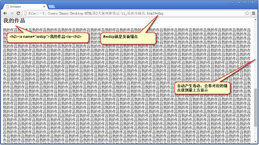

# 前端           
## 目录
- **[快捷键](#快捷键)**     
- **[互联网原理](#互联网原理)** 
- **[HTML](#htmlhypertext-markup-language-超文本标记语言)**                                                                               
    - **[Sublime](#sublime)**
    - **[html完整的骨架](#html完整的骨架)**
    - **[文档声明头](#文档声明头)**
    - **[字符集](#字符集)**
    - **[关键字和页面描述](#关键字和页面描述)**
    - **[title标签](#title标签)**
    - **[HTML的基本语法特性](#html的基本语法特性)**
    - **[h和p标签](#h和p标签)**
        - **[h标签](#h标签)**
        - **[p标签](#p标签)**
    - **[图片](#图片)**
        - **[路径说明(相对路径)](#路径说明相对路径)**
    - **[超链接](#超链接)**
    - **[页面内的锚点](#页面内的锚点)**
## 快捷键
- 键盘上除了有字母、数字之外，还有一些特殊的按键：ctrl、shift、alt、tab
    - ctrl键是英语control“控制”的意思，这个按键，单独按没有任何作用，都要和其他的按键一起按才有用。比如ctrl+c，表示同时按住ctrl键和c键，一会儿将知道这个功能是复制。
    - shift键是英语shift“换挡”的意思，按下这个按键同时击打字母，打出的就是大写字母。熟悉shift键来打大写字母，尽量少用大小写锁定键。
    - alt键是英语alternate“调整”的意思，和ctrl一样，自己按没啥用，都要和其他的按键一起按才有用。比如alt+f4，表示关闭当前的窗口，比如你正在玩儿游戏，老板来了，可以按alt+f4快速关闭窗口。
    - tab键是用于table“制表符”的意思，经常实现“切换的功能”。比如我们在word软件中同时打开了两个文档，可以用ctrl+tab键，来在两个文档之间切换。 当然，可以用alt+tab键来切换程序。
- ctrl+c 		复制
- ctrl+v 		粘贴
- ctrl+x 		剪切（就是移动文件，在原来的文件夹ctrl+x一个文件，然后在新文件夹中ctrl+v粘贴）
- ctrl+tab 		切换（具体切换什么，要看是什么软件）
- alt+F4 		关闭程序
- F2 			重命名
- F5 			刷新，比如看网页的时候，想刷新网页，按f5
- ctrl+z 		撤销，就是这一步干错了，就ctrl+z撤销
- windows+E 	打开资源管理器
- windows+D	显示桌面
- ctrl+空格		切换中英文，严禁用shift键切换
## 互联网原理
- 服务器上存放着网页的相关文件，包括html文件、css文件、js文件、图片等。当我们打开浏览器，输入网址，我们的计算机就会对这些文件发出HTTP请求。
- 服务器收到请求之后，会把这些文件通过HTTP协议，传输到我们的计算机中（保存到了刚才那个临时文件夹中）。这些文件，将在我们计算机本地的浏览器中，进行渲染、呈递。

## HTML(HyperText Markup Language 超文本标记语言)
**HTML是负责描述文档语义的语言**  
**html就是负责描述页面的语义；css负责描述页面的样式；js负责描述页面的动态效果的。**  
所以，html不能让文字居中，不能更改文字字号、字体、颜色。因为这些都是属于样式范畴，都是css干的事儿；html不能让盒子运动起来，因为这些属性行为范畴，都是js干的事儿。  
**html只能干一件事儿，就是通过标签对儿，给文本增加语义。这是html唯一能做的。**  
html是一个纯本文文件（就是用txt文件改名而成），用一些标签来描述文字的语义，这些标签在浏览器里面是看不到的，所以称为“超文本”，所以就是“超文本标记语言”了。  
> 比如，面试的时候问你，h1标签有什么作用？  
> 正确答案：给文本增加主标题的语义  
> 错误答案：给文字加粗、加黑、变大  
### Sublime
- sublime中的常用快捷键：
    - ctrl+滚轮		放大缩小文字
    - ctrl+shift+d	复制当前行
    - ctrl+shift+k	删除当前行
    - ctrl+shift+↑	上移当前行
    - ctrl+shift+↓	下移当前行
    - 点击鼠标滚轮进行多行编辑
    - html:xt 之后按tab 自动生成html基本骨架
以后击打标签的时候，仅仅需要输入标签的名字，然后按tab就可以自动生成标签对儿了。
比如，输入p然后按tab，软件自动生成。
### html完整的骨架
```html
<!DOCTYPE html PUBLIC "-//W3C//DTD XHTML 1.0 Transitional//EN" "http://www.w3.org/TR/xhtml1/DTD/xhtml1-transitional.dtd">
<html xmlns="http://www.w3.org/1999/xhtml" xml:lang="en">
	<head>
		<meta http-equiv="Content-Type" content="text/html;charset=UTF-8">
		<title>哈哈哈</title>
	</head>
	<body>
		 <h1>我是一个主标题</h1>
         <p>我是一个小段落</p>
	</body>
</html>
```
- 第1行，就是网页的声明头，这行语句，千万不要背诵，谁背谁傻。术语叫做DocType Defintion，文档类型定义，简称DTD。这行语句非常的复杂，里面暗含了一个网址。W3C就是出web规范的组织机构。html、css、js的规范都是W3C定义发布的。world wide web coalition , 国际万维网联盟。网页声明头可以告诉浏览器，这是一个什么标准的页面。
- 第2行，是最大的html标签，所有的网页内容，都要包裹在这个标签对儿里面。
    - 我们发现，html标签中，有两个属性：
        - xmlns="http://www.w3.org/1999/xhtml"   命名空间，就是一个规范；
        - xml:lang="en" 语言是英语
- 第3行，就是head标签，就是配置。
- 第4行，<meta http-equiv="Content-Type" content="text/html;charset=UTF-8"> 字符集的配置
- 第5行，<title>哈哈哈</title>  网页的标题，可以显示在浏览器的标签栏中。
- 第7行，body标签就是网页的内容，用户能够看见。
### 文档声明头
- HTML4.01里面有两大种规范，每大种规范里面又各有3种小规范。所以一共6种规范。
- HTML4.01里面规定了普通、XHTML两大种规范。
- sublime输入的html:xt  x表示XHTML，t表示transitional
- **HTML5中极大的简化了DTD，也就是说HTML5中就没有XHTML了**
```html
<!DOCTYPE html>
<!--H5-->
<html lang="en">
<head>
	<meta charset="UTF-8">
	<title>Document</title>
</head>
<body>
	
</body>
</html>
```
- 规范说明:

|大规范|小规范|
|-----------|---------|
|HTML4.01|Strict 严格的，体现在一些标签不能使用，比如u|
||Transitional   普通的|
| |Frameset     带有框架的页面|
|XHTML1.0 更为严格(严格体现在小写标签、闭合、引号)|Strict        严格的，体现在一些标签不能使用，比如u|
| |Transitional   普通的|
| |Frameset     带有框架的页面|
### 字符集
```html
<meta http-equiv="Content-Type" content="text/html;charset=UTF-8">
```
字符集用meta标签定义，meta表示“元”。“元”配置，就是表示基本的配置项目。  
中文能够使用的字符集两种：
- 第一种：UTF-8
```html
<meta http-equiv="Content-Type" content="text/html;charset=UTF-8">
```
- 第二种:gb2312
```html
<meta http-equiv="Content-Type" content="text/html;charset=gb2312">
<!--或者-->
<meta http-equiv="Content-Type" content="text/html;charset=gbk">
```
**UTF-8里面存储一个汉字3个字节。而gb2312中存储一个汉字2个字节。**
### 关键字和页面描述
- meta除了可以设置字符集，还可以设置关键字和页面描述。
- 设置页面描述：
```html
<meta name="Description" content="网易是中国领先的互联网技术公司，为用户提供免费邮箱、游戏、搜索引擎服务，开设新闻、娱乐、体育等30多个内容频道，及博客、视频、论坛等互动交流，网聚人的力量。" />
```
**只要设置Description页面描述，那么百度搜索结果，就能够显示这些语句，这个技术叫做SEO，search engine optimization，搜索引擎优化。**
```html
<meta name=”” content=”” />
```
- 定义关键词：
```html
<meta name="Keywords" content="网易,邮箱,游戏,新闻,体育,娱乐,女性,亚运,论坛,短信" />
```
这些关键词，就是告诉搜索引擎，这个网页是干嘛的，能够提高搜索命中率。让别人能够找到你，搜索到你。  
所以，一个比较完整的骨架是这样：  
```html
<!DOCTYPE html PUBLIC "-//W3C//DTD XHTML 1.0 Transitional//EN" "http://www.w3.org/TR/xhtml1/DTD/xhtml1-transitional.dtd">
<html xmlns="http://www.w3.org/1999/xhtml" xml:lang="en">
<head>
	<meta http-equiv="Content-Type" content="text/html;charset=UTF-8">
	<meta name="Keywords" content="牛逼，就牛逼" />
	<meta name="Description" content="网易是中国领先的互联网技术公司，为用户提供免费邮箱、游戏、搜索引擎服务，开设新闻、娱乐、体育等30多个内容频道，及博客、视频、论坛等互动交流，网聚人的力量。" />
	<title>Document</title>
</head>
<body>

</body>
</html>
```
### title标签
```html
<title>网页的标题</title>
```
- title也是有助于SEO搜索引擎优化的
>网页的head标签里面，表示的是页面的配置，有什么配置？  
>字符集、关键词、页面描述、页面标题。  
>还可以配置：IE适配、视口、iPhone小图标等等  

### HTML的基本语法特性
- HTML对换行不敏感，对tab不敏感
    - HTML只在乎标签的嵌套结构，嵌套的关系。谁嵌套了谁，谁被谁嵌套了，和换行、tab无关。
换不换行、tab不tab，都不影响页面的结构。
- 空白折叠现象
    - HTML中所有的文字之间，如果有空格、换行、tab都将被折叠为**一个空格**显示。
- 标签要严格封闭
### h和p标签
#### h标签
- h是**容器级**的标签。理论上里面可以放置p、ul，但是在语义上不这么做
#### p标签
- 段落
- HTML标签是分等级的，HTML将所有的标签分为两种：容器级、文本级。
    - **容器级的标签，里面可以放置任何东西**
    - **文本级的标签里面，只能放置文字、图片、表单元素。(包括文本级标签)**
- p标签是一个文本级标签。
### 图片
- HTML页面不是直接插入图片，而是插入图片的引用地址，所以也要把图片上传到服务器上。
```html

```
- 属性说明
    - src 表示图片的路径
    - alt 是英语alternate“替代”的意思，就表示不管因为什么原因，当这个**图片无法被显示**的时候，出现的**替代文字**（有的浏览器不支持）。
#### 路径说明(相对路径)
如果是上一级目录中的图片
```html

```
如果是上两级目录中的图片
```html

```
### 超链接
基本语法
```html
<a href="1.html">哈哈哈</a>
<!--href 表示要跳转的界面-->
```
- 超链接的另外两个属性说明
```html
<a href="1.html" title="啦啦啦" target="_blank">哈哈哈</a>
```
- title
    - 当鼠标停在链接地址不动时显示的悬停文字
- target
    - 在新的标签页(新窗口)中打开，如果不写就是在当前标签页中打开
#### a标签是一个文本级的标签
比如一个段落中的所有文字都能够被点击，那么应该：p包裹a
```html
<p>
	<a href="">段落段落段落段落段落段落</a>
</p>
```
错误写法:
```html
<a href="">
	<p>
		段落段落段落段落段落段落
	</p>
</a>
```
a的语义要小于p，a就是可以当做文本来处理，所以p里面相当于放的就是纯文字。
### 页面内的锚点
- 页面当中可以有锚点，所谓的锚点，就是一个小标记，这个小标记是用户不可察觉的，用户不知道这里有一个标记。
- 锚点用name属性(或id属性)来设置，一个a标签如果name属性（或者id属性），那么就是页面的一个锚点。
```html
<a name="wdzp">我的作品</a>
或者
<a id="wdzp">我的作品</a>
<!--在同一页面中会有另一个a标签-->
<a href="#wdzp">查看我的作品</a>
<!--注意必须写#-->
```
那么网址：
```html
1.html#wdzp
```
就能够让这个锚点在页面最顶端显示，此时页面有卷动。  

  
如果有一个超级链接，指向另一个页面中的锚点，那么就是：


